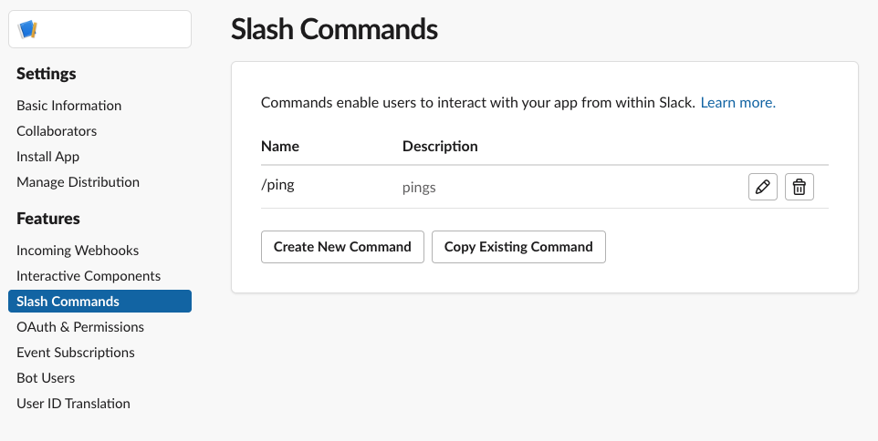
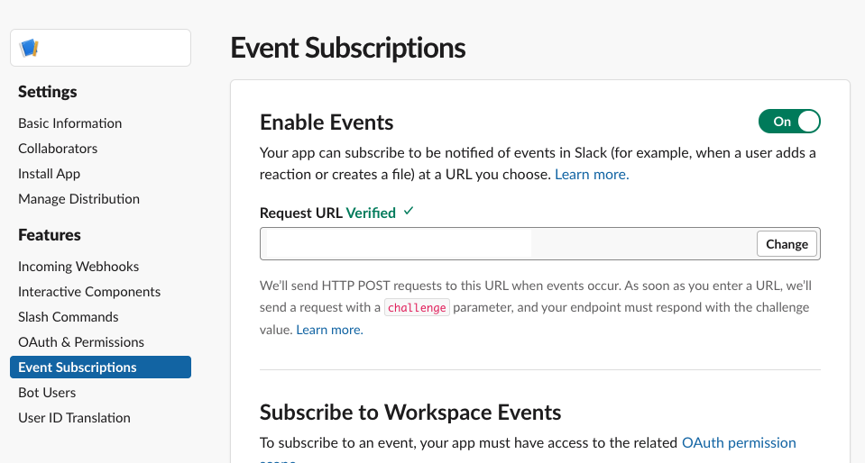
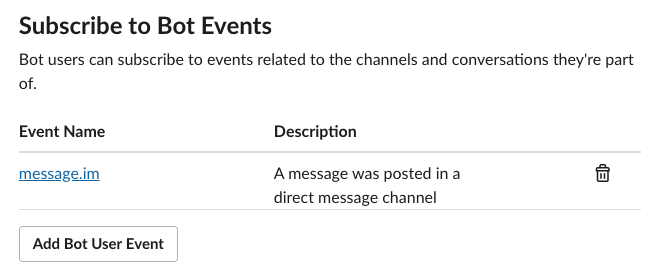
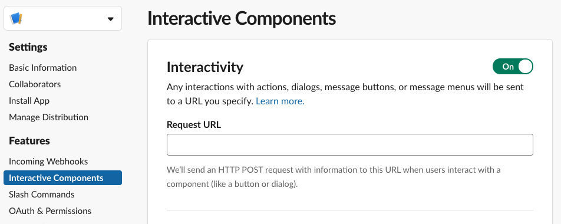

[[getting-started]]
= Getting Started
:google-analytics-account: UA-82654714-4

== Create a Slack App

To get started, you will need to set up your app on the Slack Api page
Go to https://api.slack.com/apps Under "Your Apps" create a new Slack App, give it a name and select the slack workspace you want to develop with (you can't change this workspace later).
You might want to write down the following information of your newly created Slack App in order to use the Heroku Deployment Button:

* The OAuth Token of your App
* The Client-ID of your App
* The Client-Secret of your App
* The Signing-Secret of your App

There are two ways to get started:

1. You can deploy our sample app to heroku
2. Or you can create your own app.

=== 1. Deploy to Heroku

Deploy our sample app to heroku:
++++

++++

=== 2. Create a Spring Boot Application

Create a new spring boot application for example on https://start.spring.io (best to use kotlin and gradle for this example)

Add the following to your *build.gradle* file

[source]
--

dependencies {
implementation(group: "com.kreait.slack", name: "slack-spring-boot-starter", version: "{version}")
}
--

Add the following properties to the *application.properties* file

[source]
--
//the url the user should be redirected to on a successful installation
slack.installation.success-redirect-url=

//the url the user should be redirected to on a failure during installation
slack.installation.error-redirect-url=
--

==== Credentials

Locate your app credentials under the *Basic Information* menu item on https://api.slack.com/apps (select your app) By default there is 3 ways adding your slack credentials to the application

1. Create a file $HOME/.slack/credentials

    slack_app_client_id=<client_id>
    slack_app_client_secret=<client_secret>
    slack_app_signing_secret=<signing secret>

2. Set Environment Variables

    SLACK_APP_CLIENT_ID=<client_id>
    SLACK_APP_CLIENT_SECRET=<client_secret>
    SLACK_APP_SIGNING_SECRET=<signing secret>

3. Set JVM System Properties

    slack.application.client-id=<client_id>
    slack.application.client-secret=<client_secret>
    slack.application.signing=<signing secret>

If you want to provide your own link:starter/slack-spring-boot-autoconfigure/src/main/kotlin/io/olaph/slack/broker/autoconfiguration/credentials/CredentialsProvider.kt[CredentialsProvider] implement the interface and expose it as a Bean/Component

Start your application

[source]
--
./gradlew bootRun
--

=== Configuration of your Slack App

Now you will need to set-up your App on the Slack API page.
At this point you might need to use a service like *ngrok* (which we recommend) or any other tunneling software in order to enable forwarding to your local environment.

[source]
--
./ngrok http 8080
--

== Setting up Slack
If not done already:

1. Under https://api.slack.com/apps[Apps] click on New App
2. Enter the name of your application
3. Select your development workspace and click on *Create*

[[command-guide]]
=== Create a Slash-Command

- Click on "*Slash commands*" on the left side of the navigation menu
- Click on "*Create New Command*"
- Enter the url of your application (to work on a local machine, use a tunneling tool like ngrok or forward a port to your local machine) with the endpoint */commands* and click on *save*

[[event-guide]]
=== Receive Events

- Click on "*Events*" on the left side of the navigation menu
- Click on "*enable events*" on the top right
- Start your Slack Spring Boot Application.
The https://github.com/kreait/slack-spring-boot-starter/blob/master/starter/slack-spring-boot/src/main/kotlin/com/kreait/slack/broker/broker/EventBroker.kt[EventBroker] takes care of the verification we need in the following step
- enter the url of your service with the endpoint /events
- slack will send a challenge token to your /events endpoint to verify that the service is properly set up
- Scroll down to "*Subscribe to Bot Events*" and add your events

[[interactivecomponent-guide]]
=== Receiver Interactive Components

- Click on "*Interactive Components*" on the left side of the navigation menu
- enter the url of your service with the endpoint /interactive-components

== Developing your first Slack App

To start developing, you have to create your own app-flow, by implementing <<commands,Slash-Commands>>, <<events,Events>> and <<interactive-components,Interactive Components>> .

== Deploying
